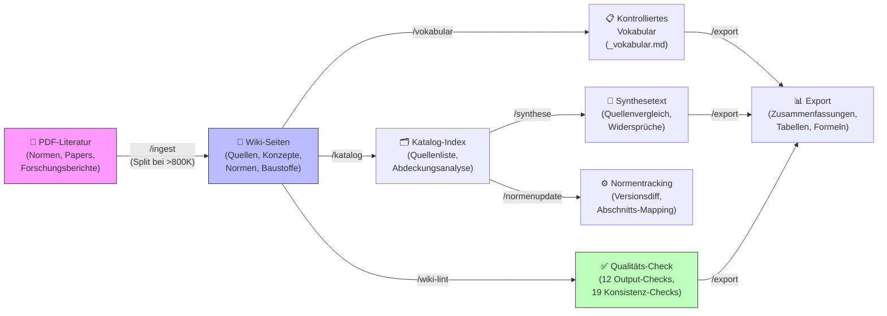

# Architektur — Bibliothek-Plugin

## Pipeline-Übersicht



## Skill-Dependencies

| Skill | Input | Output | Dispatches | Gate-Check |
|-------|-------|--------|-----------|-----------|
| `ingest` | PDF-Datei, Metadaten | Wiki-Seite (.md) | → vokabular, katalog | INGEST_STRUCTURE |
| `vokabular` | Wiki-Seiten | wiki/_vokabular.md | ← ingest, synthese | VOKABULAR_ENFORCEMENT |
| `katalog` | Wiki-Seiten + Metadaten | INDEX.md, literatur.bib-Vorschlag | ← ingest, normenupdate | KATALOG_CONSISTENCY |
| `wiki-lint` | Alle Wiki-Seiten | Fehlerbericht, Fixes | ← katalog | WIKI_LINT_RULES |
| `synthese` | Thema, Wiki-Seiten, katalog | Synthesetext (.md) | → export | SYNTHESE_INTEGRITY |
| `normenupdate` | Alte vs. neue Norm-PDFs | Norm-Wiki-Update, Diff-Report | → katalog | NORMEN_ACCURACY |
| `export` | Wiki-Seiten, katalog, _vokabular.md | Zusammenfassungen, Tabellen, Formeln | ← synthese, wiki-lint | EXPORT_INTEGRITY |
| `using-bibliothek` | Session-Hook (Governance) | — | — | Governance-Injection |

## Agent-Taxonomie

Es gibt 9 Subagents, aufgeteilt in 4 Rollen (siehe `governance/naming-konvention.md`):

### Pruefer (PASS/FAIL — blockierend)

| Agent | Dispatcht von | Prueft |
|-------|---------------|--------|
| `vollstaendigkeits-pruefer` | /ingest (Gate 1) | Alle Kapitel erfasst? kapitel-index? Zusammenfassungen? Schlagworte? |
| `quellen-pruefer` | /ingest (Gate 2), /synthese | Seitenangaben korrekt? Zahlenwerte mit Quelle? Normverweise mit Abschnitt? |
| `konsistenz-pruefer` | /ingest (Gate 3), /synthese | Widersprueche zu Wiki? Querverweise korrekt? Duplikat-Konzeptseiten? |
| `vokabular-pruefer` | /ingest (Gate 4) | Alle Schlagworte in _vokabular.md? Keine Synonyme als Primaer-Tags? |

### Reviewer (Report — nicht blockierend)

| Agent | Dispatcht von | Prueft |
|-------|---------------|--------|
| `struktur-reviewer` | /wiki-lint | Waisen-Seiten, Hub-Seiten, Coverage-Luecken, MOC-Vollstaendigkeit |
| `norm-reviewer` | /normenupdate | Abschnitts-Mapping alt→neu, Zahlenwerte-Propagierung, Norm-Markierung |

### Worker (Ausfuehrung)

| Agent | Dispatcht von | Auftrag |
|-------|---------------|---------|
| `ingest-worker` | /ingest (Phase 0.6) | PDF vollstaendig lesen, Quellenseite erstellen |
| `synthese-worker` | /synthese (Phase 0.6) | Konzeptseite aus Wiki-Quellenseiten vertiefen |

### Validator (Format-Check)

| Agent | Dispatcht von | Prueft |
|-------|---------------|--------|
| `duplikat-validator` | /ingest (Pre-Flight), /wiki-lint | Quellen-Duplikate (Autor+Jahr), Konzept-Duplikate (Synonyme) |

## Governance-Schichten

```
┌─────────────────────────────────────────────────────────────┐
│ Schicht 1: Session-Start-Hook                               │
│ → using-bibliothek injiziert Governance in Session-Context  │
└─────────────────────────────────────────────────────────────┘
                            ↓
┌─────────────────────────────────────────────────────────────┐
│ Schicht 2: Using-Block (Prompting)                           │
│ → /ingest, /katalog, /synthese, etc. verfügbar             │
│ → Kontrolliere Gate-Set für aktuelle Session                │
└─────────────────────────────────────────────────────────────┘
                            ↓
┌─────────────────────────────────────────────────────────────┐
│ Schicht 3: Skill-Governance (Enforcement)                   │
│ → INGEST_STRUCTURE, KATALOG_CONSISTENCY, etc.               │
│ → Hard Gates: Muss passen, sonst STOP                       │
│ → Hybrid Gates: Flags + Autofix-Proposal                    │
│ → Prompt-Law Gates: Audit-Trail, aber proceed              │
└─────────────────────────────────────────────────────────────┘
                            ↓
┌─────────────────────────────────────────────────────────────┐
│ Schicht 4: Subagent-Instanz (Dispatch)                      │
│ → Agent (z.B. ingest-Agent) mit lokalen Constraints        │
│ → Dispatch via ingest-dispatch-template.md /               │
│   synthese-dispatch-template.md (parametrisierter Prompt)  │
│ → Output läuft durch Shell-Check + Consistency-Check       │
└─────────────────────────────────────────────────────────────┘
```

## 3-Schichten-Architektur (seit SPEC-005)

```
CORE (immer, nicht konfigurierbar)
├── Typen: quelle, konzept
├── Verzeichnisse: quellen/, konzepte/, _index/
├── Gates: 9 universelle (VOLLSTAENDIGE-LESUNG, SEITENANGABE, ...)
├── Pipeline: Lock, Counter, FAIL-Check, ID-Matching
└── Infrastruktur: _vokabular.md, _log.md, pdfs/

DOMAIN (konfiguriert, entsteht aus Inhalt)
├── Typen: norm, baustoff, verfahren, moc, ... (erweiterbar via seitentypen.md)
├── Verzeichnisse: on-demand angelegt
├── Gates: bedingt (z.B. NORMBEZUG nur wenn Typ "norm" aktiv)
├── Kategorien: Level-1-Terme in _vokabular.md
└── Quellen-Unterordner: pdfs/<kategorie>/ on-demand

INSTANZ (das konkrete Wiki)
├── Quellen, Konzeptseiten, Domain-Seiten
├── Spezifisches Vokabular + Kategorien
└── Spezifische Domain-Typ-Konfiguration
```

## Shell-Checks und Hooks

### Aktive Hooks (Stand SPEC-003, 2026-04-11)

| Hook | Event | Matcher | Zweck |
|------|-------|---------|-------|
| `session-start` | SessionStart | startup\|resume\|clear\|compact | Governance-Context injizieren via using-bibliothek |
| `guard-wiki-writes.sh` | PreToolUse | Edit\|Write | Blockiert `wiki/**/*.md`-Writes ausserhalb der 4 Schreib-Skills (Transcript-Check) |
| `guard-pipeline-lock.sh` | PreToolUse | Agent | Blockiert ingest-worker/synthese-worker bei offenem _pending.json (gegenseitige Blockade) |
| `advance-pipeline-lock.sh` | SubagentStop | Gate-Agents | Zaehlt gates_passed, wechselt Stufe, verifiziert INGEST-ID/SYNTHESE-ID |
| `inject-lock-warning.sh` | UserPromptSubmit | — | Passive Warnung mit Typ, Quelle, Stufe, Gates-Zaehler |

**Selbst-Check im Subagent:** Gate-Agents rufen `check-wiki-output.sh` nach jeder Datei selbst auf. Kontextuelle Checks (Zahlenwerte, Normbezuege, Seitenangaben, Umlaute) werden von den Gate-Agents direkt durchgefuehrt — das Shell-Script prueft nur deterministische Aspekte.

### 12 Output-Checks (check-wiki-output.sh)

1. **Frontmatter-Type**: Feld `type:` muss im YAML-Frontmatter vorhanden sein
2. **Seitentyp-Validierung**: `type:` muss einer der definierten Typen sein (config/valid-types.txt)
3. **Schlagworte-Vokabular**: Alle `schlagworte:`-Eintraege muessen in `_vokabular.md` existieren
7. **Querverweise**: Konzept-/Verfahrens-/Baustoffseiten brauchen mindestens einen Wikilink [[...]]
8. **Offene Marker**: Keine [TODO], [UNSICHER], [PRUEFEN], [QUELLE BENOETIGT], [INGEST/SYNTHESE UNVOLLSTAENDIG]
10. **Kapitelindex**: Quellenseiten muessen `kapitel-index:` im Frontmatter haben
11. **Duplikat-Quellen**: Keine zwei Quellenseiten mit identischem Titel (exakter Match)
12. **Index-Eintrag**: (Deferred — wird bei /wiki-lint geprueft)
13. **Log-Eintrag**: (Deferred — wird bei /wiki-lint geprueft)
14. **Wikilinks-Aufloesbar**: Alle [[...]]-Links auf existierende Wiki-Dateien (mit Umlaut-Mapping)
15. **Widerspruch-Marker**: [WIDERSPRUCH]-Marker muessen zwei Quellen nennen
16. **Review-Status**: Feld `reviewed:` sollte im Frontmatter vorhanden sein

Entfernte heuristische Checks (brauchen Kontext, den Gate-Agents liefern):
- ~~04 Zahlenwert-Quelle~~ → Gate 2 (quellen-pruefer), Part A
- ~~05 Normbezug-Abschnitt~~ → Gate 2, Part A
- ~~06 Seitenangabe~~ → Gate 2, Part A
- ~~09 Korrekte Umlaute~~ → Gate 2, Part C

### 19 Plugin-Konsistenz-Checks (check-consistency.sh)

Prueft die interne Konsistenz des Plugins selbst (nicht der Wiki-Daten):

1. **Governance-Sync**: hard-gates.md ↔ using-bibliothek Inline-Kopie identisch
2. **Verarbeitungsstatus**: Nur gueltige Werte (vollstaendig/gesplittet/nur-katalog/fehlerhaft)
3. **Agent-Count**: Dateien in agents/ == Eintraege in naming-konvention.md
4. **Command-Count**: Dateien in commands/ == Skill-Verzeichnisse (ohne using-bibliothek)
5. **Gate-Count**: Jeder Skill hat 10 Gate-Zeilen in seiner Governance-Tabelle
6. **Agent-Governance**: Jeder Agent hat eine Governance-Zustaendigkeit-Tabelle
7. **Re-Review-Limit**: Jeder Agent dokumentiert sein Iterations-Limit
8. **EXTERNER-INHALT**: Lesende Skills (ingest, synthese, normenupdate) haben Wrapper-Marker
9. **Seitentypen**: governance/seitentypen.md definiert mindestens 6 Typen
10. **Vokabular-Regeln**: governance/vokabular-regeln.md vorhanden
11. **Qualitaetsstufen**: governance/qualitaetsstufen.md vorhanden
12. **Templates**: TEMPLATE-skill.md und TEMPLATE-agent.md vorhanden
13. **Ingest-Dispatch-Template**: governance/ingest-dispatch-template.md vorhanden
14. **Synthese-Dispatch-Template**: governance/synthese-dispatch-template.md vorhanden
15. **Template-Platzhalter**: Dispatch-Templates enthalten mindestens 5 `{{`-Platzhalter
16. **Skill-Template-Referenz**: ingest/SKILL.md und synthese/SKILL.md referenzieren ihre Dispatch-Templates

## Gate-Enforcement-Klassifikation

### 10 Hard Gates (inhaltliche Regeln — definiert in `governance/hard-gates.md`)

| # | Hard Gate | Typ | Durchsetzung |
|---|-----------|-----|-------------|
| 1 | KEIN-BUCH-OHNE-VOLLSTAENDIGE-LESUNG | Hybrid | Ingest Phase 1 IRON LAW + Kontext-Budget-Stopp (keine mech. Verifikation) |
| 2 | KEIN-INHALT-OHNE-SEITENANGABE | Machine-Law | check-wiki-output.sh Check 6 |
| 3 | KEIN-ZAHLENWERT-OHNE-QUELLE | Machine-Law | check-wiki-output.sh Check 4 |
| 4 | KEIN-NORMBEZUG-OHNE-ABSCHNITT | Machine-Law | check-wiki-output.sh Check 5 |
| 5 | KEINE-KONZEPTSEITE-OHNE-QUERVERWEIS | Machine-Law | check-wiki-output.sh Check 7 |
| 6 | KEIN-SCHLAGWORT-OHNE-VOKABULAR | Machine-Law | check-wiki-output.sh Check 3 + vokabular-pruefer |
| 7 | KEIN-UPDATE-OHNE-DIFF | Hybrid | Skill-Phase + _log.md Pflicht-Eintrag (Shell-Check 13 deferred) |
| 8 | KEIN-WIDERSPRUCH-OHNE-MARKIERUNG | Hybrid | Shell-Check auf [WIDERSPRUCH]-Marker + konsistenz-pruefer |
| 9 | KEINE-WIKI-AENDERUNG-OHNE-QUELLENLESUNG | Hybrid | Prompt-Law + quellen-pruefer Part D+E (Spot-Check + Semantic Fidelity) |
| 10 | KORREKTE-UMLAUTE | Machine-Law | check-wiki-output.sh Check 9 |

### Skill-Gate-Zuordnung (pro Skill welche Gates aktiv)

| Skill | Aktive Gates |
|-------|-------------|
| ingest | 1, 2, 3, 4, 5, 7, 9, 10 (+ delegiert: 6→vokabular-pruefer, 8→konsistenz-pruefer) |
| synthese | 2, 3, 4, 7, 8, 9, 10 (+ delegiert: 6→vokabular-pruefer) |
| normenupdate | 4, 7, 8, 9, 10 |
| katalog | 10 (read-only Skill) |
| wiki-lint | 8, 9, 10 (diagnostisch) |
| vokabular | 6, 10 |
| export | 10 (read-only Skill) |

## Daten-Flow-Artefakte

| Artefakt | Format | Ort | Produzent | Konsument |
|----------|--------|-----|-----------|-----------|
| Wiki-Seite | Markdown + YAML | `wiki/<typ>/*.md` | /ingest | /katalog, /synthese, /export |
| Teilindizes | Markdown | `wiki/_index/*.md` | /ingest, /katalog | /synthese, /export, /wiki-lint |
| Kontrolliertes Vokabular | Markdown | `wiki/_vokabular.md` | /vokabular | /ingest (Check), /wiki-lint |
| Aenderungsprotokoll | Markdown | `wiki/_log.md` | Alle schreibenden Skills | /wiki-lint (Audit-Trail) |
| BibTeX-Katalog | BibTeX | `Masterarbeit/literatur.bib` | /katalog (Export-Proposal, NICHT direkt schreiben!) | Pandoc (Kapitel-Build) |
| Pipeline-Lock | JSON | `wiki/_pending.json` | /ingest, /synthese (Lock-Datei waehrend Verarbeitung, gegenseitige Blockade) | `guard-pipeline-lock.sh` (blockiert), `advance-pipeline-lock.sh` (zaehlt Gates), `inject-lock-warning.sh` (warnt) |

> **Scope-Regel:** Das Bibliothek-Plugin arbeitet ausschliesslich in `wiki/`.
> Dateien ausserhalb von `wiki/` (z.B. literatur.bib) werden NICHT geschrieben.
> /katalog kann BibTeX-Vorschlaege ausgeben, aber der Nutzer pflegt sie selbst ein.
| Synthesetext | Markdown | Session-Output oder `wiki/konzepte/` | /synthese | /export, Manueller Review |
| Normen-Diff | Markdown + Tabelle | `wiki/normen/*-diff-*.md` | /normenupdate | /katalog, /synthese |
| Lint-Bericht | Markdown | `wiki/_log/_lint-report-*.md` | /wiki-lint | Manueller Review |

## Statistiken

- **Befehle:** 7 (ingest, katalog, wiki-lint, vokabular, synthese, normenupdate, export)
- **Skills:** 8 (7 Befehls-Skills + using-bibliothek Governance-Skill)
- **Agents:** 9 (4 Pruefer + 2 Reviewer + 1 Validator + 2 Worker)
- **Hard Gates:** 10 (definiert in `governance/hard-gates.md`)
- **Output-Checks:** 12 (check-wiki-output.sh, davon 10 aktiv + 2 deferred; kontextuelle via Gate-Agents)
- **Konsistenz-Checks:** 19 (check-consistency.sh)
- **Aktive Hooks:** 5 (SessionStart + PreToolUse Edit|Write + PreToolUse Agent + SubagentStop + UserPromptSubmit)
- **Governance-Schichten:** 4 (Hook → Using → Gate → Subagent)

## Wiki-Verzeichnisstruktur

Wiki-Pfad: `wiki/` relativ zum Projekt-Root.
Wird bei erstem `/ingest` automatisch angelegt (Phase 0, Bootstrap).

```
wiki/
├── quellen/           ← Quellenseiten (Buch-Zusammenfassungen)
│   ├── fingerloos-ec2-2016.md
│   └── ...
├── konzepte/          ← Konzeptseiten (Fachbegriffe, Phaenomene)
│   ├── rollschub.md
│   ├── aufhaengebewehrung.md
│   └── ...
├── normen/            ← Normseiten (Paragraph-Kommentare)
│   ├── ec2-9-2-5.md
│   ├── ec5-6-1-5.md
│   └── ...
├── baustoffe/         ← Baustoffseiten (Materialeigenschaften)
│   ├── bsh-gl24h.md
│   └── ...
├── verfahren/         ← Verfahrensseiten (Rechenmethoden)
│   ├── gamma-verfahren.md
│   └── ...
├── moc/               ← Maps of Content (Navigationsseiten)
│   ├── querkraft.md
│   └── ...
├── pdfs/             ← Original-PDFs (Obsidian oeffnet per Klick)
│   ├── neu/           ← Eingangsordner (hier PDFs reinwerfen)
│   ├── holzbau/       ← Nach Ingest sortiert nach Kategorie
│   ├── stahlbeton/
│   ├── normen/
│   ├── bauphysik/
│   ├── verbundbau/
│   └── unlesbar/      ← Fallback fuer OCR-lose Scans
├── _index/            ← Teilindizes pro Seitentyp
│   ├── quellen.md
│   ├── konzepte.md
│   ├── normen.md
│   ├── baustoffe.md
│   └── verfahren.md
├── _vokabular.md      ← Kontrolliertes Fachvokabular (Gate 6)
└── _log.md            ← Chronologisches Aenderungsprotokoll
```

Das Bibliothek-Plugin arbeitet ausschliesslich innerhalb von `wiki/`.
Dateien ausserhalb dieses Verzeichnisses werden weder gelesen noch geschrieben.
/katalog und /export geben Ergebnisse im Chat aus — der Nutzer entscheidet
was davon wohin uebernommen wird.

---

**Version:** 2.0.0 | **Stand:** 2026-04-13
